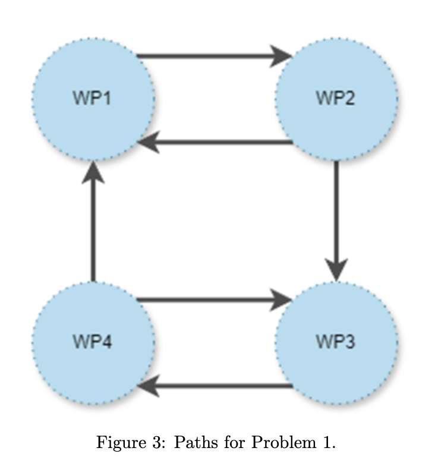
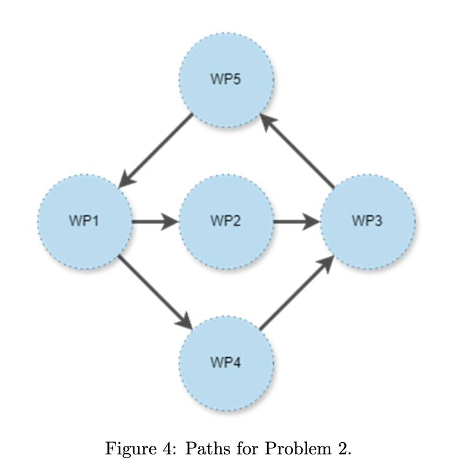
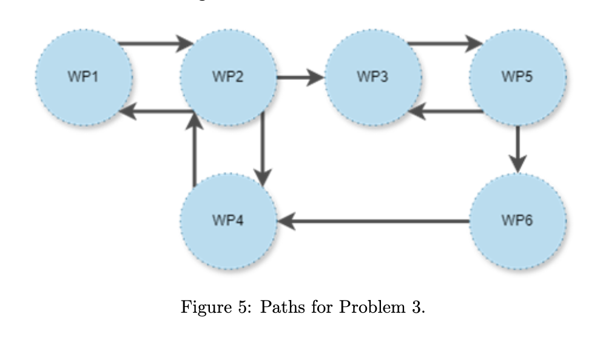

# CW 1 Automated Planning

This project plans an autonomous underwater vehicle (UUV) mission for wind farm inspection using **PDDL (Planning Domain Definition Language)**. It covers search-based problem solving and automated planning tasks using defined domain and problem files. The coursework is structured in three parts, each progressively increasing in complexity and introducing new features.

## Project Structure

The repository is organized into two main parts:

- `PartA&B/`: Contains domain and problems for Part 2A and Part 2B of the coursework.
- `PartC/`: Contains the extended domain and complex problem for Part 2C.
- `Graphs/`: Includes state space graphs for each problem.

## Domain Modelling (Part 2A)

### Task 1.1: World State Representation

- **Types**: `uuv`, `ship`, `engineer`, `sample`, `location`.
- **Predicates**:

  - `(at ?u - uuv ?l - location)` – UUV at a location.
  - `(connected ?l1 - location ?l2 - location)` – Path between two locations.
  - `(has-image ?l - location)` – Image taken at location.
  - `(has-sonar ?l - location)` – Sonar scan taken at location.
  - `(has-sample ?u - uuv)` – UUV has a collected sample.
  - `(sample-at ?s - sample ?l - location)` – Sample located at location.
  - `(stored ?s - sample ?sh - ship)` – Sample stored on ship.
  - `(deployed ?u - uuv)` – Whether UUV is deployed.

### Task 1.2: Action Definitions

Implemented actions include:

- `deploy-uuv` – Deploys UUV from ship.
- `move` – Moves UUV between connected locations.
- `take-image` – Captures image.
- `sonar-scan` – Captures sonar scan.
- `transmit-image` / `transmit-sonar` – Transmit data back to ship.
- `pickup-sample` / `deliver-sample` – Sample collection and delivery.

> **Restrictions :**
>
> - UUV deploys once.
> - One sample in memory at a time.
> - Sample must be returned to ship.
> - Ship can store only one sample.

## Problem Modelling (Part 2B)

### Problem 1

- UUV starts from ship.
- Save an **image at waypoint 3** and **sonar at waypoint 4**.

Graph:

### Problem 2

- UUV starts from ship.
- Save an **image at waypoint 5**, **sonar at waypoint 3**, and **collect sample from waypoint 1**.

Graph:

### Problem 3

- 2 UUVs and 2 ships.
- UUV1 deployed at waypoint 2. UUV2 starts from second ship.
- Goals:

  - Image at waypoint 3 & 2
  - Sonar at waypoint 4 & 6
  - Samples from waypoint 1 & 5

Graph:

## 🛠️ Extension Features (Part 2C)

### Problem 4

- AN engineer introduced.
- Ship has two inbuilt locations: **bay** and **control centre**.
- Constraints:

  - UUV deploy/return can only happen when engineer is at **bay**.
  - UUV can transmit data can only happen when engineer is at **control centre**.

Implemented using new types and actions for engineer movement and UUV constraints.

## How to Run

### Prerequisites

- Tested on: [**Editor.Planning.Domains**](https://editor.planning.domains)
- Compatible with planners:

  - **BFWS**
  - **LAMA-first**
  - **ENHSP**

### Instructions

1. Open domain/problem files in [editor.planning.domains](https://editor.planning.domains).
2. Use the "solver" option with any of the compatible planners.
3. Plans will be generated and displayed.

## Planner Used

The PDDL files in this repository have been successfully tested with the following online planners available at [editor.planning.domains](https://editor.planning.domains/):

- **BFWS –FF-parser version**
- **ENHSP**
- **LAMA-first**

## Note on PDDL Implementation

- Only PDDL features covered in the course have been used.
- Important sections of the code are commented for clarity.
- Preconditions and effects of actions have been carefully considered to accurately model the system's behavior and constraints.

## Author

- **Vaishnavi Chintha** [`@Vaishnavi-chintha`](https://github.com/Vaishnavi-chintha)
